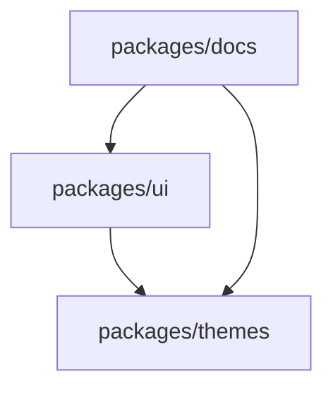
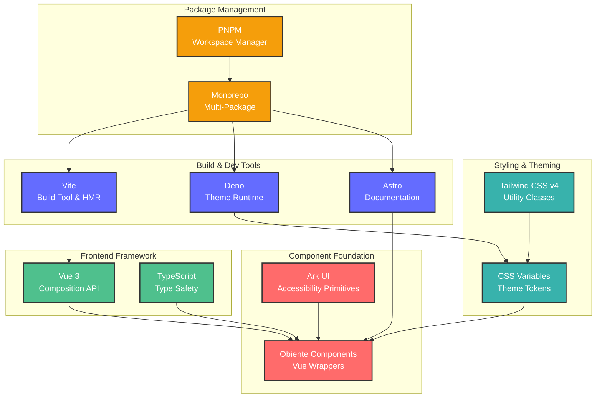

# Obiente UI

[](https://opensource.org/licenses/AGPL-3.0)
[](https://vuejs.org/)
[](https://www.typescriptlang.org/)
[](https://tailwindcss.com/)

> **Modern Vue 3 component library with extensive theming support and accessibility-first design**

Obiente UI is a comprehensive, production-ready component library built on Vue 3, featuring beautiful themes, full accessibility support via Ark UI, and a powerful theming system powered by Tailwind CSS v4.

## 🎯 Key Features

- **🎨 Beautiful Themes** - Extensive collection of carefully crafted color schemes and design variants
- **♿ Accessibility First** - Built on Ark UI primitives for complete WCAG compliance
- **🔧 TypeScript Native** - Full TypeScript support with comprehensive type definitions
- **🎛️ Flexible Theming** - Advanced theme system with CSS variables and Tailwind integration
- **📱 Responsive Design** - Mobile-first responsive components
- **🚀 Performance Optimized** - Tree-shakeable with minimal bundle size
- **🧩 Composable Architecture** - Vue 3 Composition API throughout

## 📦 Monorepo Structure

This repository contains multiple packages working together:

```
📁 packages/
├── 🎨 ui/           # Core Vue 3 components
├── 🎭 themes/       # Theme definitions (Deno-based)
└── 📚 docs/         # Documentation site (Astro)
```

## 🧩 Components

Obiente UI provides a comprehensive collection of accessible, themeable Vue 3 components. For detailed documentation, examples, and interactive demos, visit:

**[📖 Component Documentation →](https://ui.obiente.org/docs/components)**

## 🎨 Theming System

Obiente UI features a sophisticated **three-layer theming system** that provides unparalleled flexibility and customization:

### **Layer 1: Base Themes** 🏗️
Foundational scaling and proportions for design tokens:
- **Spacing** - Controls padding, margins, and gaps
- **Sizing** - Affects component dimensions and layouts  
- **Radius** - Border radius scaling for roundness
- **Typography** - Font size multipliers
- **Elevation** - Z-index and shadow intensity

### **Layer 2: Color Themes** 🎨
Complete semantic color systems with comprehensive palettes:
- **🌙 Dark Variants** - Rich, comfortable themes for low-light environments
- **☀️ Light Variants** - Bright, clean themes for high-visibility contexts
- **🎨 Multiple Families** - Diverse design approaches and aesthetic styles
- **♿ Accessible Colors** - WCAG-compliant contrast ratios

### **Layer 3: Flair Themes** ✨  
Stackable visual enhancements and effects:
- **🌟 Visual Effects** - Shadows, blurs, and animations
- **🔧 Custom Properties** - Brand-specific token overrides
- **� Stackable System** - Combine multiple flair themes
- **🎯 Priority-Based** - Fine-grained control over theme application

### Theme Structure

```typescript
interface BaseTheme {
  type: "base"
  spacing: number     // Base spacing multiplier
  sizing: number      // Component size scaling
  radius: number      // Border radius multiplier
  typography: number  // Font size scaling
  elevation: number   // Shadow/z-index scaling
}

interface ColorTheme {
  type: "color"
  variant: "light" | "dark"
  colors: {
    background: string
    foreground: string
    surface: { base: string, raised: string, overlay: string }
    accent: { primary: string, secondary: string, success: string }
    // ... comprehensive color system
  }
}

interface FlairTheme {
  type: "flair"
  stackable: true
  tokens: Record<`oi-${string}`, string>  // Custom CSS properties
}
```

## 🛠️ Development

### Prerequisites

- **Node.js** 18+ (for packages/ui, packages/docs)
- **Deno** 1.40+ (for packages/themes)
- **PNPM** 8+ (package manager)

### Local Development

```bash
# Clone the repository
git clone https://github.com/obiente/ui.git
cd ui

# Install dependencies
pnpm install

# Start development servers
pnpm dev

# Build all packages
pnpm build
```

### Development Commands

```bash
# Start all development servers
pnpm dev

# Start only docs site
pnpm dev:docs

# Start only component library
pnpm dev:lib

# Type checking
pnpm type-check

# Build production bundles
pnpm build
```

## 📚 Documentation

- **[📖 Component Documentation](packages/docs)** - Comprehensive guides and examples
- **[🎮 Interactive Playground](packages/docs/src/pages/playground.astro)** - Try components live
- **[🎨 Theme Gallery](packages/docs/src/pages/themes.astro)** - Explore available themes

## 🏗️ Architecture

### Package Dependencies



### Technology Stack



### Core Technologies

- **Vue 3** - Component framework with Composition API
- **Ark UI** - Headless component primitives for accessibility
- **TypeScript** - Type safety and developer experience
- **Tailwind CSS v4** - Utility-first styling with CSS variables
- **Vite** - Fast build tooling and HMR
- **Astro** - Static site generation for documentation
- **Deno** - Modern runtime for theme engine

## 📄 License

This project is licensed under the **AGPL-3.0** License - see the [LICENSE](LICENSE) file for details.

## 🙏 Acknowledgments

- **[Ark UI](https://ark-ui.com/)** - Accessible component primitives
- **[Tailwind CSS](https://tailwindcss.com/)** - Utility-first CSS framework
- **[Vue.js](https://vuejs.org/)** - Progressive JavaScript framework
